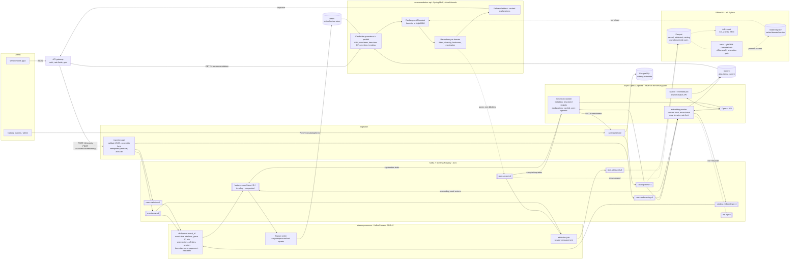
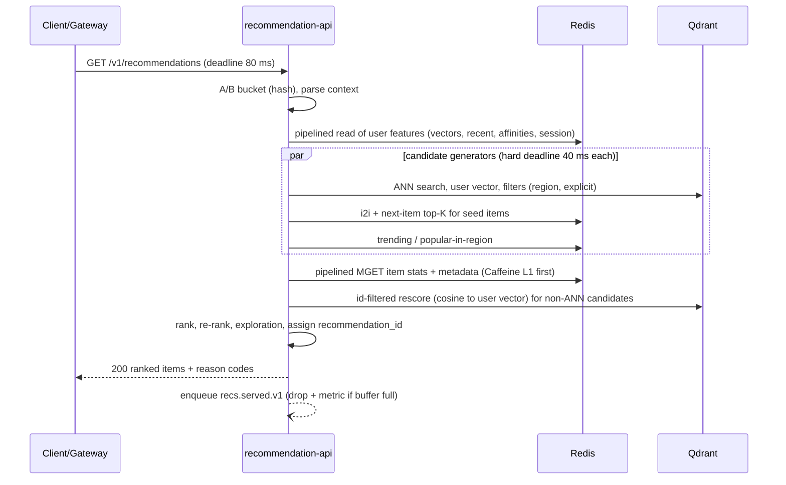
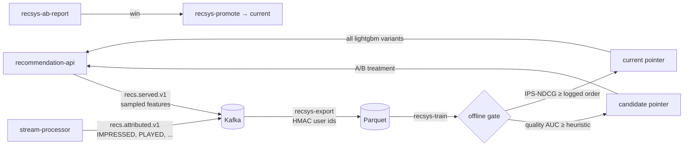

# Real-time Recommendation System: Architecture (Phase 0)

Status: Phases 1 and 2 implemented, awaiting review. Scope: songs, books, videos and posts.
Plain-language version: [`../architecture.md`](../architecture.md).

---

## 1. Assumptions and targets

| Area | Decision |
|---|---|
| Scale (prod design) | 1M DAU, ~50K events/s peak, 5M items across domains |
| Scale (local) | ~400 events/s; Phase 1: 50K songs. Phase 2: 90K items (50K songs, 10K books, 10K videos, 20K posts), ~4K simulated users |
| Serving latency | **p50 < 30 ms, p99 < 100 ms** at the API edge (excludes client network) |
| Freshness | User action reflected in recommendations **< 5 s** (measured as event `received_ts` → feature committed in Redis) |
| Region | Single AWS region; multi-region is out of scope |
| Auth | Gateway authenticates and passes `user_id`. MVP uses an API key. `TODO(phase-3)`: JWT |
| Embeddings | `text-embedding-3-small`, `dimensions=512` (configurable). `ml/recsys_ml/bench_embedding_dims.py` measures 512 vs 1536 next-item recall@K. It needs `OPENAI_API_KEY`, and hasn't been run in mock mode |
| OpenAI budget | Dev: $50/month, alerts at 50% ($25) and 80% ($40) |
| Deletion SLA | All of a user's data purged from every store within **30 days** |
| Phase 1 song embedding text | title + artist + genres + mood tags. **No lyrics.** |
| Greenfield | No existing user/catalog DB. Catalog enters through `catalog-service` |

Songs are replayable, unlike most books, videos and posts. So "remove already-consumed items" means *recently played* (current session / last 2 h) or explicitly rejected, not ever played. A familiarity cap (≤ 30% of a list from previously liked tracks) keeps lists from becoming pure repeats.

---

## 2. Architecture diagram



### Serving request path and latency budget



| Stage | p50 budget | p99 budget | On timeout |
|---|---|---|---|
| Parse, bucketing | 1 ms | 2 ms | — |
| User features (Redis, one pipeline) | 2 ms | 8 ms | Anonymous mode (trending + region) |
| Candidate generation (parallel) | 12 ms | 40 ms (hard) | Use generators that returned |
| Hydration (L1 cache → Redis) | 4 ms | 12 ms | Rank with missing features imputed |
| Semantic rescore (Qdrant, id filter, top 150 non-ANN) | 5 ms | 15 ms | Skip; similarity term = 0 for non-ANN |
| Rank + re-rank (in-memory, ~500 items) | 2 ms | 5 ms | — |
| Serialize + async log enqueue | 1 ms | 3 ms | — |
| **Total** | **~27 ms** | **< 85 ms** | Overall deadline 80 ms → fallback |

---

## 3. Components and data flow

### 3.1 ingestion-api
- `POST /v1/events` accepts a JSON batch (≤ 500 events). It validates against a JSON contract, normalizes, converts to Avro `UserEvent`, and produces to `events.raw.v1` keyed by `user_id`.
- The producer uses `enable.idempotence=true`, `acks=all`, `linger.ms=5`. It returns **202 only after the broker ack**, which gives at-least-once delivery from the client's point of view. Clients retry with the same `event_id`, so retries are safe.
- `event_id` is a client-generated UUIDv7. The server checks the format and rejects missing IDs. It does not mint IDs for clients, because a server-minted ID would break dedupe on retry.
- Timestamps: `event_ts` comes from the client and `received_ts` from the server. If `event_ts > received_ts + 60 s`, it is clamped to `received_ts` (clock skew).
- Bot/abuse guard: per-user token bucket (e.g. 20 events/s sustained). Excess events are rejected with 429 and counted.
- `POST /v1/users/{userId}/onboarding` → `users.onboarding.v1`. `DELETE /v1/users/{userId}/data` → `users.deletion.v1`.

### 3.2 catalog-service
- `POST /v1/catalog/items` upserts into Postgres (`items` table, `updated_at`, `content_hash`). It then produces `CatalogItem` to `catalog.items.v1` (compacted, keyed by `item_id`). The stream processor turns that topic into `i:{id}:meta` feature records. Nothing writes Redis directly except the feature-writer, so Redis can always be rebuilt from Kafka.
- `TODO(phase-3)`: transactional outbox (or Debezium CDC) to remove the Postgres/Kafka dual-write risk. For the MVP, a periodic reconciler re-publishes rows whose `published_seq < seq`.

### 3.3 stream-processor (Kafka Streams, `processing.guarantee=exactly_once_v2`)
Input is keyed by `user_id`. Main sub-topologies:

1. **Dedupe.** A windowed store keyed by `event_id` with 24 h retention. An `event_id` always comes with the same `user_id`, so it lands on the same partition and needs no repartition. Duplicates are dropped and counted.
2. **Lateness.** Windowed aggregates use event time with **grace = 10 min**. Events older than 24 h relative to stream time go to `events.late.v1`, which is used offline only.
3. **Signal scoring.** Each event is mapped to a signed weight `w` using the per-domain weight table (§5). Weights are loaded from config.
4. **User vectors.** Events are re-keyed by `item_id` and joined with the `catalog.embeddings.v1` KTable (partitioned, not global), then re-keyed back to `user_id` and aggregated:
   - **Short-term vector:** an exponentially decayed weighted sum, half-life 2 h. Negative `w` subtracts.
   - **Long-term vector:** the same accumulator with half-life 30 days, emitted to Redis **hourly** via punctuation.
   - Decayed sums are expressed relative to a fixed reference time (`Σ w·e·2^((t−t₀)/h)`). This makes them **order-independent**, so a late event within grace is just added with its discount, and dedupe guarantees it is added once.
   - Each vector carries its `index_version`. Serving ignores a vector whose version differs from `items_current` (see risk R3).
5. **User short-term features:** last 50 interactions; recent artist/genre/mood affinities (decayed counts, half-life 6 h); session state (session id, start, genre distribution of the session = "session intent"); recently played set (2 h).
6. **Item features:** impressions, starts, completions and early skips are kept as decayed counters (24 h half-life, plus a 1 h half-life play counter). Decayed counters are order-independent, so late events need no special handling. Derived values: **CTR** and **completion rate**, Bayesian-smoothed with priors; **velocity** = recent hourly rate / 24 h baseline rate. Emissions are throttled to at most one per item every 30 s.
7. **Co-engagement and next-item:** the user-keyed state keeps the last 5 positively engaged items in a session. It emits ordered transitions (A→B, for next-item) and unordered pairs within 24 h (for item-item CF). These are re-keyed by A and kept as decayed counts with min support. Each A keeps a top-50 neighbour list, emitted at most once every 30 s.
8. **Trending top-N:** plays are counted in **15-minute tumbling event-time windows with a 10-minute grace period** (the allowed lateness), keyed by `domain|region|item` and also by `domain|GLOBAL|item`. Each key's score is `last_hour × sqrt(min(velocity, 4))`, where velocity compares the last hour with the hour before. Each task keeps a local top-500 per region and emits it every 30 s. A single-key merger per region combines them (two-stage top-K, which avoids a hot partition).
9. **Deletion:** `users.deletion.v1` deletes the user's entries from all user-keyed stores. That writes changelog tombstones and emits tombstones to `features.user.v1`.
10. **Attribution:** `recs.served.v1` (exploded per item) joined with engagement events on `(recommendation_id, item_id)` in a 30 min window. The result goes to `recs.attributed.v1` (impression → play/complete/skip/like), feeding online metrics and training data.

All feature outputs go to **compacted topics** keyed by their **Redis key**. Each record carries a per-key monotonically increasing **`seq`** that is maintained in the state store. Under EOS, state and output commit atomically, so `seq` is consistent with the state it describes. `commit.interval.ms=100` keeps EOS latency low.

Operational settings: `num.standby.replicas=1`, static group membership, and RocksDB on local SSD. These cut restore time after rebalances.

### 3.4 feature-writer (same deployable, separate consumer group, `isolation.level=read_committed`)
- Consumes `features.*` topics and writes Redis via a **Lua compare-and-set**: store `data` only if `incoming.seq > stored.seq`. A replay or duplicate becomes a no-op, and an older value can never overwrite a newer one.
- It checks a deletion marker `u:{uid}:deleted` (TTL 30 d) and drops writes for deleted users, so a lagging replay cannot recreate their keys.
- Redis is a **rebuildable materialized view.** A sentinel key (`recs:feature-writer:sentinel`) is checked every 10 s. If it is missing (Redis lost its data), the writer seeks to the beginning of the compacted `features.*` topics and replays them. CAS makes the replay idempotent, and tombstones re-apply deletions. This was verified locally: after a Redis restart, the full feature set was back within about 30 s.
- Decoupling the Redis writes from the topology means a Redis outage stalls only the writer, not stream processing.

### 3.5 embedding-worker
- Consumes `catalog.items.v1`. It builds text with a versioned per-domain template (songs: `"{title} by {artist}. Genres: … Mood: …"`).
- It computes `content_hash = sha256(template_version | model | dims | text)` and **skips** the item if the Qdrant point in the current index already has that hash (re-embed only on change).
- Micro-batches (≤ 100 inputs or 200 ms), then calls embeddings with `model` and `dimensions` from config.
- Upserts Qdrant: point id = UUIDv5(item_id), payload `{item_id, domain, artist_id, genres, moods, explicit, regions, release_date, content_hash, index_version}`. It then produces `ItemEmbedding` to `catalog.embeddings.v1`. Both writes are idempotent, and the Kafka offset is committed after both succeed.
- Resilience (Resilience4j inside `libs/openai-client`):
  - 10 s timeout.
  - 5 retries with jittered exponential backoff; on 429, honor `Retry-After`.
  - A client-side token bucket on RPM/TPM.
  - A circuit breaker. When it opens, the worker **pauses** the consumer partitions instead of draining them into the DLQ. An outage then causes lag, not DLQ floods, and the work catches up automatically.
  - Only non-retryable failures (400s, input too long, poison records) go to `embedding.dlq.v1`, with a replay CLI.
- **Onboarding:** free text from `users.onboarding.v1` is PII-scrubbed (emails, phone numbers, URLs, handles), sent without any identifiers, and embedded. The result is the user's seed vector (`u:{id}:seed`). It is published to `features.user.v1` and applied by the feature-writer, so deletion markers and CAS apply to it too. Picks are averaged from item embeddings with no API call. Until the seed exists, the user gets popular-in-region.
- **Mock mode** (`recs.openai.mode=mock`) uses `MockEmbeddingClient`, a deterministic feature-hashing embedder over tokens (artist, genres, moods, title words), L2-normalized, at the configured dims. Similar metadata produces similar vectors, so the local MVP gives meaningful semantic results with no API key.
- Cost metrics: `recs_openai_tokens_total{model,job}` and `recs_openai_cost_usd_total{job}`, computed from a configurable price table.
- Budget guard: at 100% of the monthly budget, non-essential jobs (backfill, enrichment, explanations) pause. New-item embedding continues because its cost is negligible. An OpenAI project spend limit is set as a backstop.

### 3.6 backfill / re-embed job
- Exports catalog → JSONL → **OpenAI Batch API** (cheaper, async) → polls → bulk upserts into a **new** collection.
- Swapping the embedding model or dims, with no downtime:
  1. Create `items_<model>_<dims>_v<n+1>`.
  2. Dual-write new items to both collections. Embedding records for the new index go to a separate topic, `catalog.embeddings.<index>`. A compacted topic keyed by `item_id` keeps only one version per item, so both indexes cannot share it. The backfill job is implemented (§17).
  3. Backfill the new collection.
  4. Validate: count parity, plus recall@K on a holdout of attributed sessions.
  5. Build user vectors in the new space with a shadow topology that replays the 7 d of raw events.
  6. Atomically flip the `items_current` alias and the `index_version` config.
  7. Keep the old collection for 7 d for rollback.

### 3.7 recommendation-api
```java
interface CandidateGenerator { String source(); List<Candidate> generate(RecContext ctx, Deadline d); }
interface Ranker            { String version(); List<Scored> rank(RecContext ctx, List<Candidate> c); }
interface ReRanker          { List<Scored> apply(RecContext ctx, List<Scored> ranked); } // chained, ordered
```

**Candidate generators (Phase 1, songs).** They run in parallel on virtual threads, and results are merged and deduped by `item_id` while keeping per-source scores and the best reason.

| Source | How | Size |
|---|---|---|
| `semantic_ann` | Qdrant search with `0.7·short + 0.3·long` user vector (normalized). Filter: domain, region availability, explicit flag. The result payload is limited to item_id, artist_id, genres and moods | 120 |
| `item_item_cf` | `i:{seed}:i2i` for the last 5 positively engaged items, weighted by seed recency | 150 |
| `next_item` | `i:{seedItemId or last played}:next`, which drives the `next_track` surface | 100 |
| `trending` | `trend:song:{region}` + `trend:song:global` | 50 + 50 |
| `fresh_items` | ANN restricted to items ingested in the last 7 d (new-item cold start; also feeds the exploration pool) | 30 |
| (cold start) | With no short- or long-term vector, the ANN query uses the onboarding seed vector (`ONBOARDING_MATCH`) | — |

**HeuristicRanker v1.** All features are normalized to [0,1]. Weights live in config, per domain and per variant.
```
score = 0.30·sim_short + 0.15·sim_long + 0.15·cf + 0.10·next_item
      + 0.10·affinity(artist, genre, mood) + 0.08·popularity(smoothed CTR, log plays)
      + 0.07·completion_rate + 0.05·freshness(release-age decay)
      − penalties(recent negative on same artist, recently skipped)
```
Phase 2 adds `LightGbmRanker` behind the same interface (§15). Both rankers share `FeatureExtractor`, and those exact values are sampled into `recs.served.v1`, so training and serving use identical features.

**Re-ranker chain (in order).**
1. **Hard filters:** recently played (2 h), disliked, `not_interested` items and artists, explicit content when disallowed, region-unavailable.
2. **Diversity:** greedy selection, at most 1 track per artist in any window of 3 positions and at most 2 per artist per 10. Light genre MMR (λ = 0.8). The "no 5 in a row" requirement is a strict subset of this.
3. **Freshness boost:** items released < 14 d get a capped multiplicative boost.
4. **Familiarity cap:** ≤ 30% previously liked tracks.
5. **Exploration:** ε = 0.08 of slots (min 1 when `limit ≥ 8`), never position 0 on `next_track`. Slots are filled from a pool of new or low-impression items matching the user's top genres. Each one carries `explore=true` and its selection propensity, for unbiased offline evaluation. Thompson sampling is implemented in Phase 2 (§16).

**Fallback ladder.** Each response reports `fallbackLevel`. The API never returns 5xx for a dependency failure.

| Level | Trigger | Served from |
|---|---|---|
| `NONE` | All healthy | Full pipeline |
| `PARTIAL` | ≥ 1 generator or the rescore timed out | Remaining sources |
| `ANONYMOUS` | User features unavailable | Trending + popular-in-region |
| `CACHED_POPULAR` | Redis unavailable | In-process popular lists, refreshed every 60 s |
| `STATIC` | Cold process + Redis down | Popular list bundled at build/deploy |

Circuit breakers on Redis and Qdrant short-circuit straight to the right level, so requests don't each wait out a timeout.

**Logging.** `RecommendationServed` is produced asynchronously with a bounded buffer. When the buffer is full, it drops the record and increments a metric. It never blocks the response.

**A/B.** `bucket = murmur3(salt + user_id) mod 1000`. A variant config maps bucket ranges to ranker and re-ranker parameters. `variant_id` appears on every served record and response. Phase 1 has only `control`, but the field is plumbed end to end.

---

## 4. Storage choices and trade-offs

| Need | Choice | Why | Rejected alternatives |
|---|---|---|---|
| Event log / bus | **Kafka** (MSK in prod), KRaft locally | Replayable log, compaction, required by Kafka Streams, mature Schema Registry ecosystem | **Kinesis:** no compaction, shard limits, AWS lock-in, no Kafka Streams. **Pulsar:** smaller ecosystem and team familiarity |
| Stream processing | **Kafka Streams** | Library inside Spring Boot with no cluster to run. EOS, RocksDB state, windowing with grace. Partition-local dedupe | **Flink:** stronger event-time and very large state, but a JobManager/TaskManager cluster to operate. Revisit if state or join complexity outgrows Streams; feature logic is kept in plain classes to stay portable. **Spark Structured Streaming:** micro-batch latency fights the 5 s target |
| Online feature store | **Redis 7** (ElastiCache cluster in prod) | Sub-ms pipelined reads, Lua CAS for idempotent writes, rebuildable from compacted topics, so it needs no durability tier | **Feast:** an abstraction layer that still needs Redis underneath; not worth it yet. **DynamoDB:** single-digit-ms p99, but 500-key batch reads are costly and slower. **MemoryDB:** durability we don't need, since topics are the source of truth |
| Vector index | **Qdrant** | Fast filtered HNSW (region, explicit, domain), payload indexes, collection **aliases** for zero-downtime re-embed, optional int8 quantization | **pgvector:** HNSW at 5M × 512 with filters and p99 < 100 ms plus rebuilds is painful in Postgres. **Milvus:** heavy to run at this size. **OpenSearch k-NN:** weaker filtered ANN latency, JVM-heavy. **Pinecone:** viable managed option, rejected for cost and self-hosted parity with local dev |
| Catalog metadata | **PostgreSQL 16** | Relational source of truth for items, artists and onboarding data, plus transactional updates | **MongoDB / DynamoDB:** no advantage for this small relational model. **pgvector in Postgres:** explicitly out |
| Event schema | **Avro + Schema Registry (BACKWARD)** | Compact, schema evolution enforced at produce time, native Kafka tooling | **Protobuf:** good, but clients never touch Kafka, so its client-side benefits don't apply. **JSON Schema:** larger payloads, weaker evolution checks |
| Serving runtime | **Spring MVC + virtual threads** | Blocking code that is simple to read, debug and trace, with high concurrency | **WebFlux:** reactive complexity for no meaningful gain on Java 21 |
| Offline store (phase 2) | **S3 Parquet** via Kafka Connect S3 sink, partitioned `dt=/hour=` | Cheap, standard for training and eval | **Warehouse-first:** add later if analysts need SQL (Athena works on the same files) |

**Capacity notes (prod design).**
- **Qdrant:** 5M × 512 × 4 B ≈ **10 GB** raw vectors, plus ~0.7 GB HNSW links (m = 16). `TODO(phase-3)`: int8 scalar quantization, which holds ~2.5 GB in RAM with originals on disk for rescoring.
- **Redis:** ~3M users active in 30 d × ~5 KB (two float16 vectors at 1 KB each, recent list, affinities) ≈ 15 GB. Items: 5M × ~1.5 KB ≈ 7.5 GB. Total ≈ 25 GB plus replicas. Idle user keys have a 30 d TTL.
- **Kafka:** 50K events/s × ~400 B ≈ 20 MB/s ≈ 1.7 TB/day; with 7 d retention × RF3 ≈ 36 TB. `TODO(phase-3)`: tiered storage.

---

## 5. Signal weights

Weights are config (`recs.signals.<domain>`), applied in the stream processor. All four domains are implemented. `TODO(phase-3)`: fit weights by regressing on downstream outcomes (7-day return, session length).

### Songs (Phase 1)
| Signal | Weight | Rationale |
|---|---|---|
| Save / add to playlist | +2.0 | Strongest implicit intent to return to the track |
| Like | +1.5 | Explicit positive, but cheap to give |
| Share | +1.5 | Strong positive with a social cost |
| Replay | +1.2 | Re-listening right away is a very strong taste signal |
| Completion ≥ 90% | +1.0 | Listened through without skipping |
| Listen ≥ 30 s (not complete) | +0.4 | 30 s is the industry "counted stream" threshold, so it shows real interest |
| Search-result click | +0.3 | Intentful, but the user may be looking for something specific |
| Follow artist | +1.0 to artist affinity only | Affects artist, not this track's vector |
| Impression, no play | 0 (−0.05 after 3 repeats) | Used as the CTR denominator. Repeated ignoring means mild fatigue |
| Skip at 10–30 s | −0.3 | Gave it a chance and rejected it |
| Skip < 10 s | −0.8 | Clear mismatch. Halved if `autoplay=false` and the user is rapidly browsing (≥ 3 skips in 30 s), since that is search behavior, not rejection |
| Dislike | −2.0 | Explicit negative |
| Not interested | −3.0, plus artist suppression for 30 d | Strongest explicit negative |
| Seek forward > 30% | −0.1 | Weak impatience signal |

A skip after 30 s that ends before 50% scores 0, because it is ambiguous. A skip after 50% scores +0.2, since the listener heard most of the track. Negative contributions to a user vector are capped at a total of −30% of the positive mass, so a skip spree cannot flip the vector.

### Other domains (implemented in Phase 2; see `recs.stream.signals.*`)
| Domain | Strong + | Moderate + | Negative |
|---|---|---|---|
| Videos | completion ≥ 90% (+1.5), share (+1.5), like/save (+1.2), comment (+1.0) | watch ≥ 30 s or ≥ 25% (+0.5) | abandon < 10% (−0.5), skip < 10 s (−0.5), dislike (−2.0), not interested (−3.0) |
| Books | rating: (stars − 3) × 1.0, so 5★ = +2, 4★ = +1; save/want-to-read (+1.2); share (+1.2) | like (+1.0), detail dwell ≥ 20 s (+0.3), click (+0.2) | 2★ = −1, 1★ = −2, dislike (−1.5), not interested (−3.0) |
| Posts | comment (+1.5), share (+1.5), save (+1.2), like (+0.8) | dwell ≥ 5 s (+0.3), click (+0.2) | not interested (−3.0), dislike (−1.5), scroll-past < 1 s (−0.05) |

Why these differ by domain:
- **Videos** are long, so completion is rare and strongly positive, and abandoning in the first 10% is the clearest negative.
- **Books** are rarely finished inside the product, so an explicit rating dominates. A save (want-to-read) is stronger than a click.
- **Posts** are skimmed. Active engagement (comment, share) beats a passive like. A scroll-past is only a very weak negative, because most of a feed is scrolled past.

---

## 6. Kafka topics

| Topic | Key | Cleanup | Retention | Partitions (prod / local) |
|---|---|---|---|---|
| `events.raw.v1` | user_id | delete | **7 d** | 48 / 3 |
| `events.late.v1`, `events.invalid.v1` | user_id | delete | 7 d | 6 / 1 |
| `users.onboarding.v1` | user_id | delete | **3 d** | 6 / 1 |
| `users.deletion.v1` | user_id | delete | 30 d | 6 / 1 |
| `catalog.items.v1` | item_id | compact | ∞ | 12 / 3 |
| `catalog.embeddings.v1` | item_id | compact | ∞ | 12 / 3 |
| `features.user.v1` | user_id | compact, `max.compaction.lag.ms=7d`, `delete.retention.ms=1d` | ∞ (tombstoned) | 48 / 3 |
| `features.item.v1`, `features.i2i.v1`, `features.next.v1`, `features.trending.v1` | item_id / region | compact | ∞ | 24 / 3 |
| `recs.served.v1` | user_id | delete | **7 d** | 24 / 3 |
| `recs.attributed.v1` | recommendation_id | delete | 7 d | 24 / 3 |
| `embedding.dlq.v1` | item_id | delete | 14 d | 3 / 1 |

Kafka Streams internal changelogs for user-keyed stores get `max.compaction.lag.ms=7d`, set via topic-config overrides. Repartition topics are purged by Streams after commit.

---

## 7. Event schema (Avro)

Namespace `com.recsys.events.v1`. Enums declare a `default` so older readers tolerate new symbols. Every optional field is `["null", T]` with `default: null`, which keeps changes BACKWARD-compatible. All four domains are present from day one.

```json
{
  "type": "record", "name": "UserEvent", "namespace": "com.recsys.events.v1",
  "fields": [
    {"name": "event_id",   "type": {"type": "string", "logicalType": "uuid"}},
    {"name": "user_id",    "type": "string"},
    {"name": "item_id",    "type": ["null", "string"], "default": null, "doc": "null for SEARCH"},
    {"name": "domain",     "type": {"type": "enum", "name": "Domain",
                            "symbols": ["UNKNOWN", "SONG", "BOOK", "VIDEO", "POST"], "default": "UNKNOWN"}},
    {"name": "event_type", "type": {"type": "enum", "name": "EventType", "default": "UNKNOWN",
      "symbols": ["UNKNOWN", "IMPRESSION", "CLICK", "PLAY_START", "PLAY_END", "SKIP", "REPLAY", "SEEK",
                  "LIKE", "DISLIKE", "SHARE", "SAVE", "COMMENT", "RATE", "FOLLOW", "NOT_INTERESTED",
                  "DWELL", "SEARCH", "SEARCH_RESULT_CLICK"]}},
    {"name": "value",      "type": ["null", "double"], "default": null,
      "doc": "PLAY_END/SKIP: seconds listened; RATE: 1-5; DWELL: seconds"},
    {"name": "event_ts",    "type": {"type": "long", "logicalType": "timestamp-millis"}, "doc": "client time, clamped"},
    {"name": "received_ts", "type": {"type": "long", "logicalType": "timestamp-millis"}, "doc": "server time"},
    {"name": "session_id",  "type": "string"},
    {"name": "context", "type": {"type": "record", "name": "Context", "fields": [
      {"name": "device",   "type": {"type": "enum", "name": "Device",
                             "symbols": ["UNKNOWN", "IOS", "ANDROID", "WEB", "DESKTOP", "TV", "SPEAKER"], "default": "UNKNOWN"}},
      {"name": "app_version", "type": ["null", "string"], "default": null},
      {"name": "country",  "type": ["null", "string"], "default": null, "doc": "ISO-3166 alpha-2"},
      {"name": "tz_offset_min", "type": ["null", "int"], "default": null, "doc": "derives local time of day"},
      {"name": "surface",  "type": ["null", "string"], "default": null, "doc": "home, next_track, search, ..."},
      {"name": "referrer", "type": ["null", "string"], "default": null},
      {"name": "autoplay", "type": ["null", "boolean"], "default": null}
    ]}},
    {"name": "media", "type": ["null", {"type": "record", "name": "MediaProgress", "fields": [
      {"name": "position_ms",  "type": ["null", "long"], "default": null, "doc": "e.g. skip position"},
      {"name": "duration_ms",  "type": ["null", "long"], "default": null},
      {"name": "seek_from_ms", "type": ["null", "long"], "default": null},
      {"name": "seek_to_ms",   "type": ["null", "long"], "default": null}
    ]}], "default": null},
    {"name": "recommendation_id", "type": ["null", "string"], "default": null},
    {"name": "position",          "type": ["null", "int"],    "default": null, "doc": "slot in served list"},
    {"name": "variant_id",        "type": ["null", "string"], "default": null},
    {"name": "search_query_id",   "type": ["null", "string"], "default": null, "doc": "no raw query text (PII)"}
  ]
}
```

Other schemas (fields abbreviated):
- **`CatalogItem`**: `item_id, domain, title, creator_id, creator_name, genres[], mood_tags[], duration_ms?, release_date?, explicit, available_regions[], description?, updated_at, seq`.
- **`ItemEmbedding`**: `item_id, domain, index_version, model, dims, content_hash, vector: array<float>, embedded_at`.
- **`RecommendationServed`**: `recommendation_id, user_id, domain, surface, variant_id, ranker_version, index_version, fallback_level, served_ts, items[]{item_id, position, score, source[], reason_code, explore, propensity, features?: map<float> (sampled)}`.
- **`RecommendationAttributed`**: `recommendation_id, item_id, position, user_id, variant_id, outcome (PLAYED|COMPLETED|SKIPPED_EARLY|LIKED|SAVED|NONE), first_outcome_ts`.
- **Internal topics are JSON, not Avro.** This applies to `features.*`, the repartition topics and the state-store changelogs. They are owned and read by one service and are not contracts. `features.*` values are a `FeatureEnvelope {seq, ttlSeconds, sourceTs, data}`, where `data` is the exact JSON stored in Redis (`UserShortTerm`, `UserVector`, `ItemStats`, `Neighbors`, `TrendingList`; see `libs/feature-store`). A null value means delete. Every topic that crosses a service boundary is Avro. `TODO(phase-3)`: a binary serde for state stores.
- **`UserDeletionRequested`**: `user_id, requested_ts, request_id`.

---

## 8. API contracts

All endpoints are versioned under `/v1`. They take `X-Api-Key` (MVP), propagate `traceparent`, and return `X-Request-Id`.

### `POST /v1/events` (ingestion)
```json
{ "events": [ {
    "eventId": "01929a7e-...", "userId": "u_123", "itemId": "s_456", "domain": "song",
    "eventType": "skip", "value": 7.2, "eventTs": "2026-10-02T09:15:03.120Z", "sessionId": "sess_9",
    "context": { "device": "ios", "country": "US", "tzOffsetMin": -420, "surface": "next_track", "autoplay": true },
    "media": { "positionMs": 7200, "durationMs": 214000 },
    "recommendationId": "01929a7d-...", "position": 0, "variantId": "control"
} ] }
```
- Returns `202 {"accepted": n, "rejected": [{"index": 3, "eventId": "...", "error": "MISSING_SESSION_ID"}]}` with partial acceptance. Batch limit is 500 events or 1 MB.
- Error codes: `400` malformed batch, `401`, `413`, `429`. Resending an accepted `eventId` is harmless, because it is deduplicated downstream.

### `GET /v1/recommendations`
| Param | Req | Notes |
|---|---|---|
| `userId` | ✓ | MVP: query param. Phase 3: must match the gateway-asserted identity |
| `domain` | ✓ | `song` in Phase 1. Others → `400 DOMAIN_NOT_ENABLED` |
| `context` | | Surface: `home` (default), `next_track`, `radio` |
| `limit` | | 1–50, default 20 |
| `sessionId`, `seedItemId` | | `seedItemId` = currently playing track (for `next_track`) |
| `country`, `device`, `explicit` | | Usually injected by the gateway. `explicit` defaults to the user setting, else `true` |

```json
{
  "recommendationId": "01929a7d-...", "userId": "u_123", "domain": "song", "context": "next_track",
  "variantId": "control", "rankerVersion": "heuristic-v1", "indexVersion": "items_te3s_512_v1",
  "fallbackLevel": "NONE", "generatedAt": "2026-10-02T09:15:04.002Z",
  "items": [
    { "itemId": "s_789", "position": 0, "score": 0.83, "recommendationId": "01929a7d-...",
      "reasonCode": "OFTEN_PLAYED_NEXT", "reasonContext": { "seedItemId": "s_456" }, "explanation": null }
  ]
}
```
- `reasonCode` is one of `SIMILAR_TO_RECENT`, `SIMILAR_TO_TASTE`, `LISTENED_TOGETHER`, `OFTEN_PLAYED_NEXT`, `TRENDING`, `POPULAR_IN_REGION`, `NEW_FOR_YOU` (exploration), `ONBOARDING_MATCH`, `POPULAR_FALLBACK`.
- `explanation` is a cached LLM sentence (§10), otherwise null, in which case the client renders a template from the reason code.
- `reasonCode` also includes `CROSS_DOMAIN`: the user is new to this domain, and their taste in other domains drove retrieval.
- `context`: `home`, `next_track`, `radio`, `feed` (posts) or `related` (videos).
- `GET /v1/experiments/assignment?userId=&domain=` returns `{variantId, bucket, ranker}` for QA.
- `Cache-Control: no-store`.

### Others
- `POST /v1/catalog/items` upserts up to 1,000 items and returns `202`. `DELETE /v1/catalog/items/{itemId}` removes one; it produces a tombstone and deletes the Qdrant point.
- `POST /v1/users/{userId}/onboarding` takes `{"picks": {"artistIds": [], "genres": [], "itemIds": []}, "freeText": "..."}` and returns `202`. The `freeText` limit is 500 chars.
- `DELETE /v1/users/{userId}/data` returns `202 {"requestId": "..."}`. Completion is tracked in Postgres `deletion_requests`.
- `GET /actuator/health/{liveness,readiness}` and `GET /actuator/prometheus` on every service.

---

## 9. Privacy and user data deletion

The flow: `DELETE /v1/users/{id}/data` → `users.deletion.v1` → each store applies its own mechanism. **Tombstones only purge data on compacted topics, and only once compaction actually runs.** That is why compacted user-keyed topics set `max.compaction.lag.ms`. Delete-policy topics cannot be tombstoned at all; they rely on retention ≤ 30 d.

| Store | Mechanism | Purged within |
|---|---|---|
| `events.raw.v1`, `recs.served.v1`, `recs.attributed.v1`, late/invalid topics | Delete policy, 7 d retention (the data ages out) | ≤ 7 d |
| `users.onboarding.v1` | Delete policy, 3 d retention | ≤ 3 d |
| `features.user.v1` + user-keyed Streams changelogs | Tombstone + `max.compaction.lag.ms=7d`, `delete.retention.ms=1d` | ≤ 8 d |
| Streams state (RocksDB) | Topology deletes the keys on `UserDeletionRequested`. Windowed stores age out | immediate / ≤ 24 h |
| Redis | Feature-writer `DEL`s the deterministic key list `u:{uid}:*` (hash-tagged; no `SCAN`) and sets marker `u:{uid}:deleted` (TTL 30 d) so replays can't recreate keys | seconds |
| Postgres | Delete onboarding answers and the user's pseudonymization key | immediate |
| Qdrant | Holds **no per-user data** (asserted by test) | n/a |
| Item-keyed aggregates (CTR, co-engagement counts) | Aggregate counts with no user identifier; not personal data | n/a |
| S3 (Phase 2) | Raw partitions `dt=` with a 30 d lifecycle expiry. Long-lived training sets replace `user_id` with `HMAC(user_key, user_id)`, so deleting `user_key` crypto-shreds them | ≤ 30 d |
| Logs | No free text. 14 d retention | ≤ 14 d |
| OpenAI | No user identifiers are ever sent. Onboarding text is scrubbed; subject to OpenAI API data-retention terms. `TODO(phase-3)`: evaluate zero-data-retention eligibility | — |

A daily job marks a `deletion_requests` row complete once its longest bound (S3 lifecycle) has elapsed. An integration test asserts that no key or record for a deleted test user survives in Redis, the Streams stores or the compacted topics.

---

## 10. Async LLM enrichment and explanations (Phase 2)
`services/enrichment-worker` runs two Kafka listeners. Both are `NON_ESSENTIAL` jobs, so the budget guard pauses them at 100% of the monthly budget. Both use a deterministic mock LLM in `mock` mode.

- **Metadata enrichment** (`item-enricher`, consumes `catalog.items.v1`):
  - Runs for items missing moods, themes or topics whose `enrichment_version` is older than the configured version.
  - Sends only item content (title, creator, genres, curated moods, description, transcript summary) to the configured chat model, using **structured outputs**: a strict JSON schema where moods, tone and reading level come from closed enums, and themes and topics are at most 5 tags each.
  - The output is **re-validated** against the vocabularies, plus tag hygiene: lowercase, ≤ 40 chars, no URLs, emails or handles. It is then written through `PATCH /v1/catalog/items/{id}/enrichment` on catalog-service, the catalog's only writer.
  - That endpoint is idempotent by version. Enriched values live in separate columns, so a catalog reload never wipes them, and curated values always win.
  - The item's seq is bumped, so it is re-published and re-embedded. The v2 embedding templates include themes and topics, so retrieval improves too.
  - Bad input (a refusal) is skipped. Outages pause the consumer with backoff.
- **"Why this" explanations** (`explainer`, consumes `recs.served.v1`):
  - Takes a deterministic sample of served lists (20% locally) and their top 3 items.
  - Keys are `expl:{sha256(domain|reason|seed|item)}`, never the user, so one sentence serves everyone who gets that recommendation for that reason, and the prompt contains no user data.
  - The output is validated (single line, ≤ 160 chars, no links), then published to `features.item.v1` with a 30-day TTL, which the feature-writer applies to Redis. Redis therefore stays rebuildable.
  - Serving reads the cache with a 5 ms budget and never waits for generation.
- **LLM re-ranking:** async batch only (for example a daily "books for you" email) over ≤ 50 candidates. Never used for feeds. `TODO(phase-3)`: not built.

## 11. Observability
- **Metrics:**
  - Per-stage latency histograms.
  - `fallback_level` counts.
  - Generator hit and timeout rates.
  - Consumer lag (Kafka exporter).
  - **Freshness:** `received_ts → Redis commit` histogram, measured in the feature-writer.
  - Dedupe and late-event rates.
  - Redis/Qdrant latency and L1 cache hit rate.
  - OpenAI tokens, cost, error rate and breaker state.
  - Online CTR, completion and skip rate per variant (from `recs.attributed.v1`).
- **Tracing:** OpenTelemetry, with `traceparent` propagated through Kafka headers so ingestion → stream → writer is traceable.
- **Logs:** Spring Boot structured JSON with `trace_id`, `user_id`, `recommendation_id`.
- **Alerts:** p99 > 100 ms for 5 min; freshness p95 > 5 s; consumer lag growing; fallback rate > 2%; OpenAI budget at 50% / 80%.

## 12. Evaluation
- **Offline** (`ml/recsys_ml/metrics.py`, `train.py`):
  - Metrics: NDCG@10, precision@5, recall@5, coverage@5, intra-list diversity@5 (share of distinct creators) and novelty@5 (mean −log2 popularity).
  - Computed on a later time slice (split by group, so nothing leaks across the split), comparing the model's order with the logged serving order.
  - Exploration propensities are logged for IPS estimates. `TODO(phase-3)`: an IPS/SNIPS estimator.
- **Online:** `recs_online_outcomes_total` and `recs_online_served_items_total` by domain, variant and outcome (Prometheus). `ml/recsys_ml/ab_report.py` adds CTR, completion, early-skip and like rates per variant, with 95% CIs, two-proportion z-tests against control, and a sample-ratio-mismatch check.

---

## 13. Key risks and mitigations

| # | Risk | Mitigation |
|---|---|---|
| R1 | Tail latency from Redis/Qdrant blows p99 | Per-stage hard deadlines, parallel generators, partial results, breakers, Caffeine L1 for item metadata and trending, pipelined reads, fallback ladder |
| R2 | Replays or retries regress Redis/Qdrant state (outside EOS) | Absolute values with per-key `seq`, Lua CAS, deterministic Qdrant point IDs, no increments on serving state, deletion marker |
| R3 | Embedding model or dims change invalidates user vectors (different space) | `index_version` on every vector. Serving ignores mismatches (falls back to CF/trending). Shadow topology rebuilds user vectors before the alias flip |
| R4 | OpenAI outage, rate limits or cost overrun | Never on the hot path. Pause partitions on breaker open (lag, not DLQ). Token bucket. Budget guard and alerts. Mock client for dev and tests |
| R5 | Feedback loop / popularity bias / filter bubbles | Exploration slots with logged propensities, diversity rules, coverage and novelty metrics, trending capped per artist |
| R6 | Hot keys (viral track, trending lists) | Two-stage top-K, 30 s emit suppression, L1 cache (1 s TTL) for trending, Redis read replicas |
| R7 | Bots or power users skew partitions and co-engagement | Per-user rate limit at ingestion, per-user per-window contribution caps, anomaly flag on event rate |
| R8 | Clock skew and late or out-of-order events | Server clamp, event-time windows with 10 min grace, order-independent decayed sums, 24 h dedupe window, late topic |
| R9 | Co-occurrence pair explosion | Last 5 items per session only, min support, top-50 pruning, decay |
| R10 | Streams rebalance or state-restore stalls freshness | Standby replicas, static membership, cooperative rebalancing, local SSD for RocksDB, restore-time alert |
| R11 | Catalog Postgres/Kafka dual-write inconsistency | MVP reconciler on `published_seq`. `TODO(phase-3)`: outbox / Debezium |
| R12 | PII leakage (free text, logs, OpenAI) | No raw queries or free text in events or logs. Scrubbing before OpenAI. Short retention. Crypto-shredding in S3 |
| R13 | Deletion incomplete (tombstones not compacted, delete-policy topics) | Retention ≤ 7 d on raw topics, `max.compaction.lag.ms`, deletion marker, automated deletion integration test |
| R14 | Training/serving skew for the learned ranker | Log sampled serving-time features in `recs.served.v1`. Shared feature code in `libs/feature-store` |
| R15 | Cold start quality | Onboarding seed vector, popular-in-region, new items embedded on ingest and eligible for exploration within seconds |
| R16 | Kafka storage cost at prod scale (~36 TB) | 7 d retention, compression (zstd), `TODO(phase-3)` tiered storage |
| R17 | JVMs sizing their heap from the host instead of the container (seen locally as OOM kills and multi-second GC stalls) | Every container has a memory limit. JVMs use `MaxRAMPercentage=60` (40 for the stream processor, which needs room for RocksDB), capped direct memory, G1, and exit on OOM. RocksDB uses a bounded shared block cache. `TODO(phase-3)`: requests/limits in K8s from load-test profiles |
| R19 | An enrichment or template rollout mass re-embeds the catalog, and the Qdrant re-index storm hurts serving (seen locally: Qdrant at 660% CPU, about 2% client timeouts) | The enricher is throttled (`max-items-per-second`). Bulk rollouts go through the backfill job into a new index plus an alias switch, not in-place upserts. `TODO(phase-3)`: Qdrant optimizer settings and a dedicated indexing node |
| R20 | The LLM produces wrong or unsafe metadata | Strict schemas with closed vocabularies, re-validation (tags, lengths, no URLs or handles), curated values always win, enrichment is versioned and idempotent. Explanations are user-agnostic, length-capped and link-free |
| R21 | A learned ranker regresses quality, or offline evaluation is misleading because logged clicks are position-biased | Two-stage gate: a position-free offline quality check, then an online A/B with confidence intervals and an SRM check. Promotion is an explicit pointer flip, and rollback means pointing back to the previous version. Missing or invalid models fall back to the heuristic, visibly |
| R22 | Training/serving skew | One `FeatureExtractor` computes the features both rankers use. The same values are logged, and the registry refuses models whose feature list differs |
| R18 | Per-request allocation on the hot path causing GC pauses | Ranking features are built only for the sampled 5% of requests that get logged. Search payloads are trimmed. Rescore is capped at 150 ids. Verified with k6 at 200 req/s: p50 2.5 ms, p99 27 ms, longest GC pause 13 ms |

---

## 14. Multi-domain and cross-domain signals (Phase 2)
- **Per-domain everything that differs; shared everything that doesn't.**
  - Per domain: signal weights (§5), consumed windows (song 2 h, video and post 30 d, book 365 d), re-rank rules (creator diversity windows, familiarity cap, freshness boost; posts favour recency), embedding templates, A/B experiments, trained rankers and static fallback lists.
  - Shared: the event schema, the pipeline, the feature store, the candidate generators and the serving code.
- **User state:** one `UserState` per user with a `DomainState` per domain. Redis keys are `u:{id}:st:<domain>`, `u:{id}:lt:<domain>` and `u:{id}:seed:<domain>`, plus `u:{id}:x`. Co-engagement (i2i, next-item) is computed within a domain's session.
- **Cross-domain signals:**
  - Every domain is embedded into one space, and the templates share topic vocabulary.
  - The stream processor keeps a cross-domain taste vector `u:{id}:x` (7 d half-life over all domains' engagement).
  - Serving queries ANN with `0.6·short + 0.25·long + 0.15·cross` (renormalized) for users with in-domain history.
  - For users new to a domain it queries with the cross-domain vector (blended with the onboarding seed, if any), and marks those items with reason `CROSS_DOMAIN`.
  - Verified: a user who only rated a jazz book gets jazz songs (`RecsTopologyTest`, `RecommendationServiceTest`).
- **Item statistics** classify starts per domain: play for songs and videos, click for books, engaged dwell for posts. Trending therefore works for every domain.

## 15. Learned ranking: training pipeline and model versioning (Phase 2)



- **Features:** `FeatureExtractor` (semantic, cf, next, affinity, trending, ctr, completion, freshness, penalty). It is shared by both rankers. Sampled requests log exactly these values on `recs.served.v1`, at 5% in production and 50% locally.
- **Labels:**
  - Each served item takes the maximum grade over its attributed outcomes: SAVED 4, LIKED 3, COMPLETED 2, PLAYED 1, IMPRESSED/SKIPPED_EARLY/DISLIKED 0.
  - Exposure comes from `IMPRESSED` outcomes, which the client sends for visible slots.
  - Groups are `recommendation_id`s, and groups without a positive are dropped.
- **Model:**
  - LightGBM LambdaRank, one model per domain, split by time and by group.
  - The served position is a training feature, to absorb position bias, and is fixed to 0 at inference.
- **Gating:** two stages, because logged clicks favour the policy that produced them.
  - Single-click surfaces have one positive per list, so IPS cancels out of NDCG and offline replay cannot judge a new ranking.
  - Candidate gate (position-free): among engaged items, AUC of model score vs logged heuristic score for good outcomes (≥ COMPLETED/LIKED) vs poor ones.
  - Auto-promotion to `current`: requires IPS-weighted NDCG@5 at or above the logged order as well.
- **Registry:** `ml/models/ranker/<domain>/<version>/{model.json, metadata.json}` with `candidate` and `current` pointers, flipped by atomic rename. `metadata.json` records the features, parameters, data window, label distribution, offline metrics and feature importance.
- **Serving:**
  - The registry polls every 30 s and hot-swaps.
  - LightGBM's JSON dump is scored by a **pure-Java evaluator**, with no native code on the hot path. Its output matches LightGBM to within 1e-9 (`LightGbmModelTest`, with a fixture from `ml/scripts/make_parity_fixture.py`).
  - Variants choose `heuristic`, `lightgbm` (current) or `lightgbm:candidate`.
  - A missing or mismatched model falls back to the heuristic. The served `ranker_version` shows which ranker actually ran.
- **Rollback:** point `current` (or `candidate`) back at the previous version with `recsys-promote`. Versions are immutable.
- `TODO(phase-3)`: an object-store registry with approvals, scheduled retraining, an IPS/SNIPS estimator using the exploration propensities, LightGBM's unbiased-LambdaMART position mode, and a training-data drift check.

## 16. A/B testing framework (Phase 2)
- **Assignment:** per domain, `murmur2(salt:user) mod 1000` gives a bucket in [0, 1000), and variants own bucket ranges. Assignment is deterministic and stateless, so it's the same on every replica. Experiments in different domains have independent salts.
- **Variant config:**
  - Ranker (`heuristic` | `lightgbm` | `lightgbm:candidate`).
  - Heuristic weights.
  - Exploration strategy override (`epsilon` | `thompson`).
- **Logging:** `variant_id` and `ranker_version` appear on every served list and response, and `variant_id` is carried on events and attributed outcomes.
- **Analysis:**
  - Online: Prometheus counters by domain, variant and outcome.
  - Offline: `recsys-ab-report` computes CTR (played / impressed), completion, early-skip and like rates per variant, with 95% CIs, two-proportion z-tests against control, and a **sample-ratio-mismatch** chi-square against the configured split.
  - QA: `GET /v1/experiments/assignment`.
- **Exploration:**
  - ε-greedy, or **Thompson sampling** on Beta(starts + 1, impressions − starts + 1) per item.
  - New items, which have no evidence, explore broadly. Items that keep failing stop being explored.
  - Thompson propensities are estimated by Monte Carlo (100 draws) and logged.
- `TODO(phase-3)`: overlapping experiment layers, sequential testing / CUPED, guardrail metrics and auto-stop.

## 17. Re-embedding runbook (model or dimension change)
1. Run `embedding-worker` with profile `backfill` and `--recs.backfill.target-index=items_te3s_1536_v1`.
   - It reads the compacted catalog end to end and embeds through the **OpenAI Batch API**: JSONL upload → batch → poll → results.
   - It writes Qdrant collection `items_te3s_1536_v1` and topic `catalog.embeddings.items_te3s_1536_v1`.
   - It validates count parity, and with `switch-alias=true` it flips `items_current` only if every item was embedded.
2. Deploy a shadow stream-processor: new `application-id`, `RECS_INDEX_VERSION=items_te3s_1536_v1` and `RECS_EMBEDDINGS_TOPIC` set to the new topic. Replay the 7 d of raw events so user vectors are rebuilt in the new space.
3. Switch the API and the main stream-processor to the new index version. User vectors from the old space are ignored until rebuilt, because their `index_version` doesn't match. Keep the old collection for 7 d for rollback.

